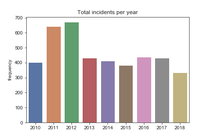
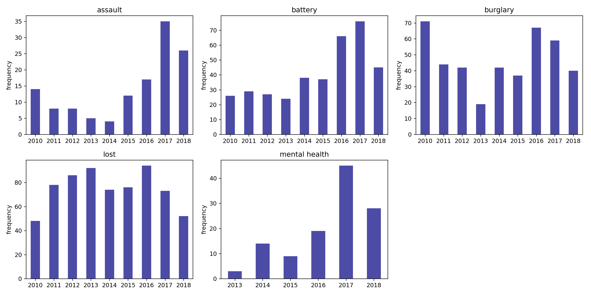
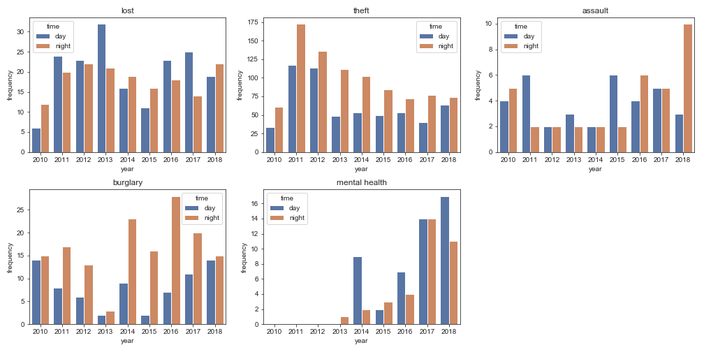
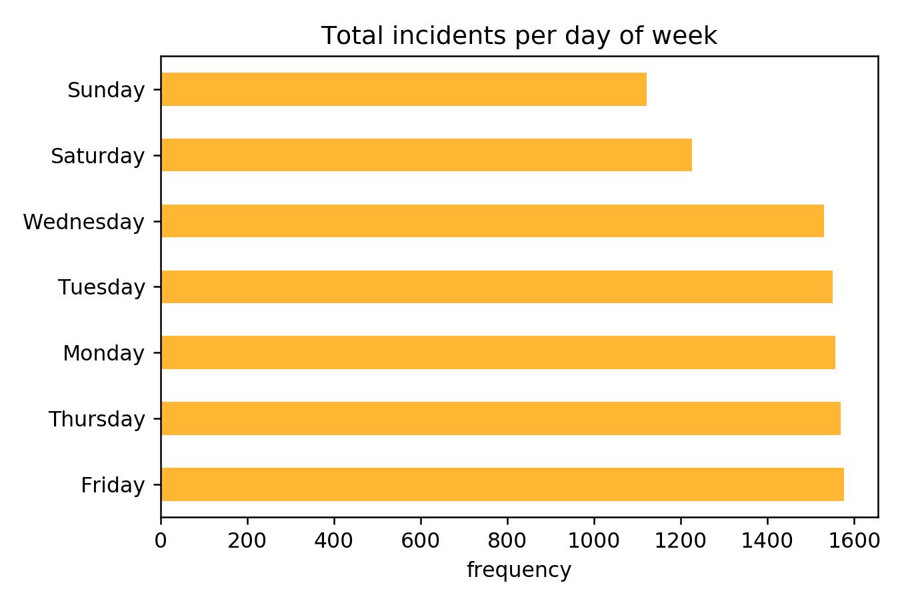

# uchicago-crime-report
## Info
This repository holds code used to scrap and clean 8+ years, 2010-07-01 to 2019-01-05, worth of crime and fire related incidents reported by the University of Chicago Police Department. The patrol area is between 37th and 64th streets and Cottage Grove Avenue to Lake Shore Drive (Kenwood/HydePark/Woodlawn area).  The public data can be found here -> [Daily Crime/Fire Log](https://incidentreports.uchicago.edu/)

The data folder contains raw and processed data: raw data is in json file containing the following format 

 { 
 "Incident": "Lost Property", 
 "Location": "5810 S. University (Quad)", 
 "Reported": "7/1/10 12:42 PM", 
 "Occured": "6/28/10 2:45 PM",  
 "Comments": "Woman reports losing a Canon Power Shot digital camera while in the Quad",  
 "Disposition": "Closed",  
 "UCPD_ID": "W0731"
  }
 
and the processed csv data. The cleaning procedure included 
- Geocoding all incident locations
- Approximating time of incident since certain incidents are reported as a time range. Incident occurring w/ a range of six hours where deemed appropriate approx
- Tagging seven crimes of interest: **assault**, **battery**, **burglary**, **lost property**, **mental health**, **robbery**, and **theft**
- Labeling if incident occurred during day or night 

**Note**: Having mental health issues is in no way a crime. It wasn't after seeing the data did I noticed mental health incidents were being reported. It is included in order to increase awareness. 

The data sample:  

| Comments | Incident | Location  | Occurred | Reported | Tag | approx_occurred | latitude | longitude | day_night |
| ------------- | ------------- | ------------- | ------------- | ------------- | ------------- | ------------- | ------------- | ------------- | ------------- |
| 3 unknown suspects struck victim with fists... | robbery / vehicle hijacking | 5558 s kimbark | 3/18/17 4:05 PM | 2017-03-18 16:07:00 | robbery | 2017-03-18 16:05:00 | 41.66861859999999 | -87.7841447 | 1 |
| staff member reports losing wallet containing... | lost property | 5810 s university | 9/19/18 10:22 PM | 9/19/18 11:12 PM | lost | 2018-09-19 22:22:00| 41.66861859999999 | -87.7841447 | 0 |

### Motivation
Wanted to familiarize myself w/ webscraping (scrapy), interactive web mapping (folium), and Tableau.

## Questions
- [x] Is there an overall crime trend? Constant/increasing/decreasing?
- [x] And what about specific incidents?
- [ ] Are there "hot" areas of crime?
- [x] Is daytime safer than nighttime?

## Observations

Recalling that 2010 has half a year of reporting one can assume that the number of incidents would be comparable to those in 2011 and 2012. After 2012 it appears that the total number of incidents has gone down and remained somewhat constant. Whether this is due to less reporting or enhanced security it cannot be said. Now what about specific incident trends?

## More in campus or outside? Check interactive cluster (coming soon)
Check out 2018's in the meantime [Nbviewer data interactive](https://nbviewer.jupyter.org/github/aaron-ortega/uchicago-crime-analysis/blob/master/data_interactive.ipynb)

- **Assault** reports have increased over the last past three years.
- **Burglary** was bad in 2010 as it tops over the other years and with only six months worth of data (ouch!) 
- **Lost** property happens and it won't ever stop
- **Theft** has been on the decline these past years, but we won't know if the trend will continue for 2018. 
- A third of **Mental Health** incidents where reported by the University's Student Counseling Service

During incident reports, an approximation on the "time of incident" is usually given and it can be anywhere from a few hours to days. Hence, the difficulty of finding if an incident occurred during day or nighttime. The data below represents those which could be pinpointed. A [sunset-sunrise API](https://sunrise-sunset.org/api) was used to determine the information below.

**Important**  Just using the plot below isn't enough to say anything about day or nighttime crime prevalence; half of the total reports could not be classified. One can use 2017 and 2018's assaults as an example. In 2017, 35 assaults where reported compared to 2018's 25 (as of September). However, the plot gives the impression that nightime 2018 has been pervasive and that cannot be supported with the shown data.

Finally, here is a breakdown by day and surprisingly the weekend is less eventful.

